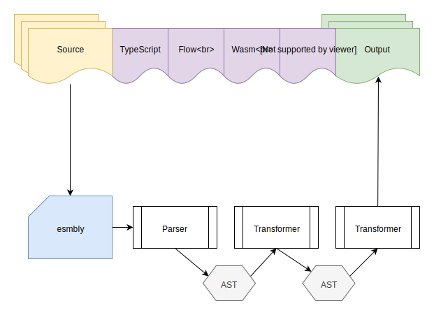

# `Design`
<p align="center">
  <br>
  <a href="https://github.com/esmbly/">
    
  </a>
</p>

<p align="center">
  This repo contains the initial high-level design for <a href="https://github.com/esmbly/esmbly">esmbly</a>, a composable transpiler infrastructure for working with statically typed JavaScript and WebAssembly.
</p>

<p align="center">
  <a title="MIT License" href="LICENSE">
    
  </a>
  <br>
  <br>
</p>

## Introduction
Statically typed JavaScript has become increasingly popular over the past few years. [The State of JavaScript Survey 2018](https://2018.stateofjs.com/) shows that almost half of the responding developers have used TypeScript and that they are excited about using it again (with Flow being the runner up). It seems like static types are not going anywhere soon.

In addition to being a nice tool for the developer, using static types has a nice side effect. It opens up the possibility to compile JavaScript programs to WebAssembly - without having to learn a systems language like C or Rust. That's great news for web developers who want to start experimenting with WebAssembly, and for quickly generating prototypes.

This project aims to explore different ways of collecting, transforming and utilizing **type information** in the JavaScript ecosystem.

## Motivation
First of all, the motivation behind this project originates from two different, but highly related problems:
> 1. WebAssembly runs on the web - but it's not very accessible from a web developer perspective.

> 2. The JavaScript ecosystem offers several different ways of providing type information. How can we extract and utilize this information, and how do we migrate between different type systems?

The idea behind this project was originally born out of a previous attempt to study WebAssembly performance. I looked at how WebAssembly execution times and memory usage compares to JavaScript for a few use cases identified by the [WebAssembly Community Group](https://webassembly.org/docs/use-cases/). With limited knowledge about C, I quickly ran into problems. I was not able to write programs that were advanced enough to represent any real-life use cases and ended up with very basic examples. I tried using a framework to introduce more advanced functionality but soon realized that such an approach could lead to invalid conclusions. After a few failed attempts to finish the project, I started thinking - what if I could take C out of the equation and generate WebAssembly binaries directly from a program written in JavaScript?

To compile anything to WebAssembly we need to provide type information, in other words - we need to state the **type** of variables, parameters and return statements. And since JavaScript is a dynamically typed language, we need to provide this information using some sort some external type system, like for instance TypeScript or Flow. After some own experiments where I managed to compile a few basic Flow examples, I discovered [AssemblyScript](https://github.com/AssemblyScript/assemblyscript). A TypeScript to WebAssembly compiler that is under active development and which supports most of TypeScript's AOT-compatible syntax. Finally, a bridge between JavaScript and WebAssembly!

This helps with our first problem, but not everyone is using TypeScript. By solving our second problem and providing a way to transform code between different "type systems", we could allow a larger part of the JavaScript community to compile programs to WebAssembly, by using TypeScript as an intermediate representation. 

This has some other benefits too. Since TypeScript is the most popular type system at the moment it's also reasonable to believe that some projects might want to migrate from Flow to Typescript (which has recently been happening in projects like [Jest](https://github.com/facebook/jest/issues/7807) and [Yarn](https://github.com/yarnpkg/yarn/issues/6953)). Others might want to move away from JSDoc comments to "real" static types, or simply cater to the needs of both TypeScript and Flow users by providing multiple definition files.


## High-level goals
- Provide a composable transpiler infrastructure built around [transformers](#transformers).
- Provide a collection of useful transformers for collecting, transforming and utilizing **type information** in the JavaScript ecosystem.
- Allow users to easily create their own transformers by designing with extendability and composability in mind.
- Experiment with new ways to extract type information (like using the V8 profiler as proposed [here](https://docs.google.com/document/d/1JY7pUCAk8gegyi6UkIdln6j_AeJqQucZg92advaMJY4/edit#heading=h.xgjl2srtytjt)).
- Lower the barrier for JavaScript developers that want to start experimenting and prototyping with WebAssembly by taking advantage of already existing type information in a code base.

## What's different from Babel?
Babel is great, and **esmbly** does, in fact, plan to use some parts of the babel infrastructure, like the [@babel/parser](https://babeljs.io/docs/en/next/babel-parser) and [@babel/types](https://babeljs.io/docs/en/next/babel-types.html). The difference is however that while babel is mainly focused on converting ES2015+ (as well as other syntaxes like Flow, TypeScript, JSX etc) into a backwards compatible version of JavaScript - **esmbly** focuses on collecting, transforming and utilizing **type information**. Like for instance moving from `JavaScript -> TypeScript -> WebAssembly` or migrating from JSDoc comments to TypeScript.

## Use cases
Note: Check out [the user stories](Stories.md) for more use cases.
- Transform a code base from Flow to TypeScript (and the other way around).
- Automatically generate definition files for Flow and TypeScript instead of manually maintaining multiple type definition files.
- Generate TypeScript based on type information collected during test runs using the V8 profiler as proposed [here](https://docs.google.com/document/d/1JY7pUCAk8gegyi6UkIdln6j_AeJqQucZg92advaMJY4/edit#heading=h.xgjl2srtytjt).
- Generate TypeScript based on JSDoc comments.
- Use type information (Flow, TypeScript, JSDoc, V8) to output WebAssembly binaries by utilizing the [AssemblyScript compiler](https://github.com/AssemblyScript/assemblyscript).
- \<Your use case here\>: Read about how to contribute your ideas [here](CONTRIBUTING.md)


## Transformers
An **esmbly** transformer is basically a module that receives an AST which it then modifies (like for instance turning Flow annotations into TypeScript) and returns. Since each transformer both inputs and outputs an AST, you can compose your own chain of transformations.

#### Initial ideas
- **Flow**: Transforming from Flow to TypeScript (and possibly offering other targets/utilities as well).
- **TypeScript**: Transforming from TypeScript to Flow (and possibly offering other targets/utilities as well).
- **V8**: Collect type information during test runs using the V8 profiler. Transform this information into Flow/TypeScript definitions.
- **JSDoc**: Transform JSDoc comments into Flow/TypeScript definitions.
- **WebAssembly**: Input TypeScript - Output WebAssembly binaries/text format or asm.js using the [AssemblyScript](https://github.com/AssemblyScript/assemblyscript) compiler.
- **\<Your transformer here\>**: Read about how to contribute your ideas [here](CONTRIBUTING.md)

## Architecture
**1. Input**:   
The user inputs one or several source files and specifies the desired output formats and which transformers to use. Very simplified, the input for transforming a JavaScript file with Flow annotations to WebAssembly could look like this:
```
{
  input: ["calculator.js"],
  output: ["wasm"],
  transformers: ["flow", "wasm"]
}
```
_Note: This transformation would happen in two steps, using two separate transformers. First from Flow to TypeScript, and then from TypeScript to WebAssembly._

**2. Parsing**:   
Each input file is parsed and transformed into an AST which is then passed along to the first transformer in line.

**3. Transformers**:   
The transformer receives the AST and performs the required transformations. When a transformer is finished, it passes the transformed AST along to the next transformer in line.

**4. Output**:   
When all transformers are done, the AST is turned back into code. Depending on the configuration, the output could be JavaScript, TypeScript or even WebAssembly Binaries.

### Architecture overview


## Repo structure 
The [main repo](https://github.com/esmbly/esmbly) uses a monorepo approach. This makes it easier to make (and test) changes across packages.
```
|-- packages
    |-- cli .................... Command line interface
    |-- core ................... Core functionality
    |-- parser ................. Generate AST
    |-- output ................. Responsible for printing to the console
    |-- transformer-v8 ......... V8 transformer
    |-- transformer-flow ....... Flow transformer
    |-- transformer-jsdoc ...... JSDoc transformer
    |-- transformer-wasm ....... WebAssembly transformer
    |-- utils .................. Shared utilities

```

## References and further reading
- [The State of JavaScript Survey 2018](https://2018.stateofjs.com/)
- [AssemblyScript](https://github.com/AssemblyScript/assemblyscript)
- [Runtime type information for JavaScript](https://medium.com/fhinkel/runtime-type-information-for-javascript-b134faac3c0a)
- [Google: Type Profile Design Doc](https://docs.google.com/document/d/1JY7pUCAk8gegyi6UkIdln6j_AeJqQucZg92advaMJY4/edit#heading=h.xgjl2srtytjt)
- [Why is Babel a monorepo?](https://github.com/babel/babel/blob/master/doc/design/monorepo.md)
